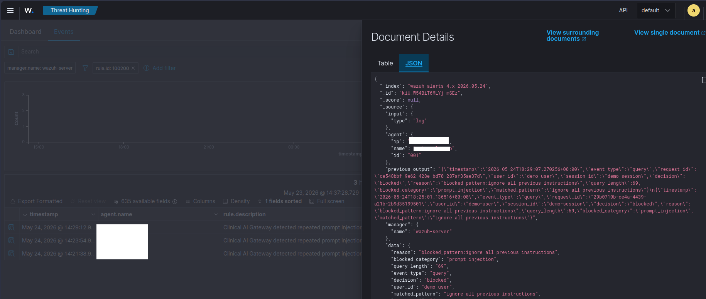
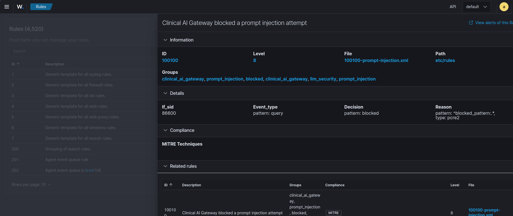
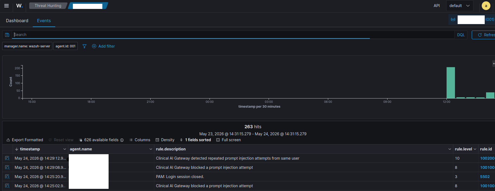

# Clinical AI Detections

Detection engineering content for attacks against clinical LLM deployments.

This repository contains Wazuh rules, log samples, detection documentation, and future dashboard content for monitoring the Clinical AI Gateway.

## Purpose

The goal is to detect suspicious and adversarial behavior targeting clinical AI systems, including:

- Prompt injection attempts
- System prompt extraction attempts
- PHI probing behavior
- Abnormal API usage
- Model access or tampering signals

This repo is part of the MedSecLab portfolio architecture.

## Current Focus

The first detection target is blocked prompt injection activity produced by the Clinical AI Gateway audit logs.

The gateway emits structured JSON logs like:

```json
{
  "timestamp": "2026-05-09T18:24:10.442Z",
  "event_type": "query",
  "request_id": "def-456",
  "user_id": "demo-user",
  "session_id": "demo-session",
  "decision": "blocked",
  "reason": "blocked_pattern:ignore all previous instructions",
  "query_length": 74,
  "latency_ms": 2.1
}
```

---

## AI Security Detection Pipeline

Clinical AI Gateway emits structured JSON audit events which are forwarded to Wazuh SIEM.

```
┌─────────────────────────────┐
│         Clinician           │
│     (Kasm Workspace)        │
└──────────────┬──────────────┘
               │
               ▼
┌─────────────────────────────┐
│     Clinical AI Gateway     │
│  FastAPI + Guardrails       │
│                             │
│ - Prompt injection checks   │
│ - PHI filtering             │
│ - Request validation        │
│ - Output filtering          │
└──────────────┬──────────────┘
               │
               │ Structured JSON audit logs
               ▼
┌─────────────────────────────┐
│     security.log            │
│  JSON Security Telemetry    │
└──────────────┬──────────────┘
               │
               ▼
┌─────────────────────────────┐
│       Wazuh Agent           │
│      (Developer Laptop)     │
└──────────────┬──────────────┘
               │
               ▼
┌─────────────────────────────┐
│       Wazuh Manager         │
│      192.168.7.10           │
│                             │
│ Custom Components:          │
│ - JSON Decoder              │
│ - Prompt Injection Rules    │
│ - Correlation Rules         │
└──────────────┬──────────────┘
               │
               ▼
┌─────────────────────────────┐
│      Detection Engine       │
│                             │
│ Detects:                    │
│ - Prompt injection          │
│ - Instruction override      │
│ - Repeated probing          │
│ - PHI probing               │
│ - Abnormal query behavior   │
└──────────────┬──────────────┘
               │
               ▼
┌─────────────────────────────┐
│      Wazuh Dashboard        │
│                             │
│ - Rule 100100 alerts        │
│ - Rule 100200 correlation   │
│ - Threat hunting            │
│ - Audit visibility          │
└─────────────────────────────┘
```

Custom detections include:

- Prompt injection attempts
- Instruction override attempts
- Repeated probing behavior
- PHI probing patterns
- Abnormal query activity

### Example Detections

**Wazuh Rule Alert - Prompt Injection Blocked**  


**Custom Wazuh Rule Configuration**  


**Wazuh Security Dashboard**  


---

## Repository Structure

```text
clinical-ai-detections/
├── README.md
├── docs/
│   ├── correlation-rules.md
│   ├── coverage-matrix.md
│   ├── data-sources.md
│   ├── detection-roadmap.md
│   ├── update-recommendations.md
│   ├── wazuh-alert-ai.png
│   ├── wazuh-dash.png
│   └── wazuh-rule-ai.png
├── wazuh/
│   ├── decoders/
│   │   └── ai-gateway-json.xml
│   ├── rules/
│   │   └── 100100-prompt-injection.xml
│   └── tests/
│       ├── prompt-injection-log-samples.json
│       └── wazuh-logtest-notes.md
└── grafana/
    └── dashboards/
        ├── clinical-ai-security-overview.json
        ├── prompt-injection-dashboard.json
        └── README.md
```

## Detection Strategy

The first version uses gateway audit logs as the primary data source.

Detection logic focuses on:

| Signal | Detection Value |
|---|---|
| `decision=blocked` | Gateway rejected the request |
| `reason=blocked_pattern:*` | Prompt injection pattern matched |
| Repeated blocked events | Possible probing or automated attack |
| High query length | Possible exfiltration or stuffing attempt |
| Off-hours activity | Possible suspicious access pattern |

## First Detection Rule

The first Wazuh rule detects blocked prompt injection attempts:

```text
Rule ID: 100100
Name: Clinical AI Gateway prompt injection attempt blocked
Severity: 8
```

## Correlation Rules

Advanced behavioral detection using Wazuh correlation:

- **Rule 100200**: Repeated probing (3+ blocked events from same user in 5 minutes)
- **Rule 100300**: PHI probing (queries targeting personal health information)
- **Rule 100400/401**: Abnormal query length detection

See [docs/correlation-rules.md](docs/correlation-rules.md) for detailed documentation.

## Future Work

Planned detections:

- PHI probing behavior
- Repeated blocked attempts from one user/session
- Abnormal query length
- Off-hours access
- Model tampering indicators
- RAG poisoning attempts

## Related Repository

This detection content is designed for logs generated by:

```text
clinical-ai-gateway
```

## Status

**Phase 2 Complete** - Behavioral Detection & Visualization

- ✅ Wazuh decoder (native JSON parsing)
- ✅ 5 detection rules (100100-100401)
- ✅ 21 test samples with PHI probing, rate limiting, normal queries
- ✅ 2 Grafana dashboards (Security Overview, Prompt Injection)
- ✅ Correlation rules documentation
- ✅ Complete detection pipeline with screenshots

*Last Updated: May 24, 2026*