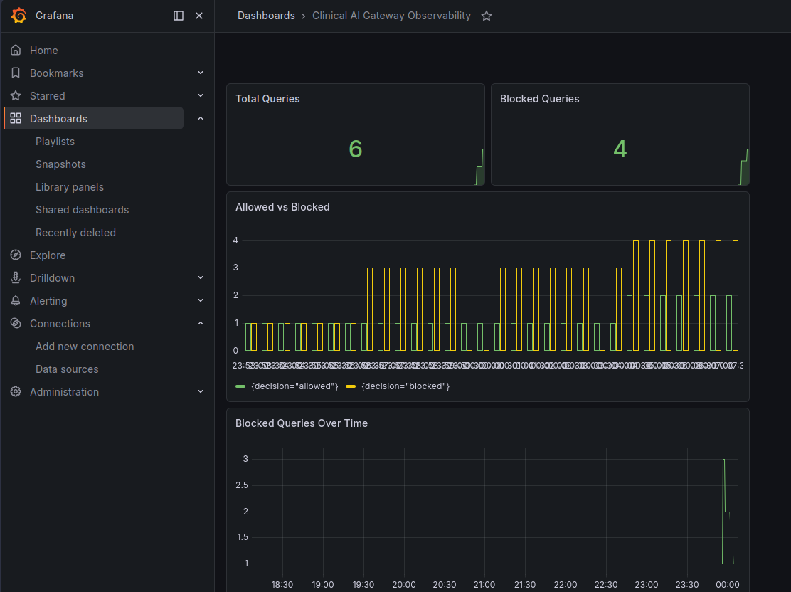

# Clinical AI Detections


-blue)


Detection engineering content for attacks against clinical LLM deployments.

This repository contains Wazuh rules, log samples, detection documentation, and Grafana dashboards for monitoring the Clinical AI Gateway. Part of the [MedSecLab](https://github.com/MohsenBah/MedSecLab) portfolio.

## Quick Start

```bash
# Validate all detection rules offline (no SIEM required — runs in CI)
python3 scripts/validate_rules.py --offline
```

## Purpose

The goal is to detect suspicious and adversarial behavior targeting clinical AI systems, including:

- Prompt injection attempts
- System prompt extraction attempts
- PHI probing behavior
- Abnormal API usage
- Model access or tampering signals

This repo is part of the MedSecLab portfolio architecture.

## Detection Target

The first detection target is blocked prompt injection activity produced by the Clinical AI Gateway audit logs.

The gateway emits structured JSON logs like:

```json
{
  "timestamp": "2026-05-09T18:24:10.442Z",
  "event_type": "query",
  "request_id": "def-456",
  "user_id": "demo-user",
  "session_id": "demo-session",
  "decision": "blocked",
  "reason": "blocked_pattern:ignore all previous instructions",
  "query_length": 74,
  "latency_ms": 2.1
}
```

---

## AI Security Detection Pipeline

Clinical AI Gateway emits structured JSON audit events which flow through the observability and detection stack:

```
┌─────────────────────────────┐
│         Clinician           │
│     (Kasm Workspace)        │
└──────────────┬──────────────┘
               │
               ▼
┌─────────────────────────────┐
│       AI Gateway            │
│  FastAPI + Guardrails       │
│                             │
│ - Prompt injection checks   │
│ - PHI filtering             │
│ - Request validation        │
│ - Output filtering          │
└──────────────┬──────────────┘
               │
               │ Structured security telemetry
               ▼
┌─────────────────────────────┐
│         Promtail            │
│      Log Shipping           │
└──────────────┬──────────────┘
               │
               ▼
┌─────────────────────────────┐
│           Loki              │
│      Log Aggregation        │
└──────────────┬──────────────┘
               │
               ▼
┌─────────────────────────────┐
│      Grafana Dashboards     │
│   Visualization & Alerting  │
└──────────────┬──────────────┘
               │
               ▼
┌─────────────────────────────┐
│      Wazuh Detections       │
│                             │
│ - Prompt injection          │
│ - Instruction override      │
│ - Repeated probing          │
│ - PHI probing               │
│ - Abnormal query behavior   │
└─────────────────────────────┘
```

### Architecture Components

| Component | Purpose |
|-----------|---------|
| **AI Gateway** | FastAPI application with guardrails for input/output validation |
| **security.log** | Structured JSON security telemetry (10MB rotation, 5 backups) |
| **Promtail** | Log shipper that tails security.log and forwards to Loki |
| **Loki** | Log aggregation system for querying and storing log streams |
| **Grafana** | Dashboards for visualization, metrics, and alerting |
| **Wazuh** | SIEM for detection rules, correlation, and compliance |

### Grafana Observability Stack



---

## Example Detections

**Wazuh Rule Alert - Prompt Injection Blocked**  


**Custom Wazuh Rule Configuration**  


**Wazuh Security Dashboard**  


---

## Repository Structure

```text
clinical-ai-detections/
├── README.md
├── docs/
│   ├── correlation-rules.md
│   ├── coverage-matrix.md
│   ├── mitre-atlas-mapping.md
│   ├── compliance-matrix.md
│   ├── data-sources.md
│   ├── detection-roadmap.md
│   ├── grafana.png
│   ├── wazuh-alert-ai.png
│   ├── wazuh-dash.png
│   └── wazuh-rule-ai.png
├── wazuh/
│   ├── decoders/
│   │   └── ai-gateway-json.xml
│   ├── rules/
│   │   └── 100100-prompt-injection.xml
│   └── tests/
│       ├── validation-cases.json
│       ├── validation-readme.md
│       ├── prompt-injection-log-samples.json
│       └── wazuh-logtest-notes.md
├── scripts/
│   ├── validate_rules.py
│   └── run_validation.sh
├── .github/workflows/
│   └── validate-detections.yml
└── grafana/
    └── dashboards/
        ├── clinical-ai-security-overview.json
        ├── prompt-injection-dashboard.json
        ├── rag-ingestion-dashboard.json
        └── README.md
```

## Detection Strategy

The detection pipeline uses multiple data paths:

| Path | Technology | Use Case |
|------|------------|----------|
| **Wazuh Rules** | Custom decoders + rules | Real-time SIEM alerting |
| **Grafana + Loki** | LogQL queries | Ad-hoc investigation, metrics |
| **Correlation** | Wazuh frequency/timeframe | Behavioral anomaly detection |

Detection logic focuses on:

| Signal | Detection Value |
|---|---|
| `decision=blocked` | Gateway rejected the request |
| `reason=blocked_pattern:*` | Prompt injection pattern matched |
| Repeated blocked events | Possible probing or automated attack |
| High query length | Possible exfiltration or stuffing attempt |
| Off-hours activity | Possible suspicious access pattern |

## First Detection Rule

The first Wazuh rule detects blocked prompt injection attempts:

```text
Rule ID: 100100
Name: Clinical AI Gateway prompt injection attempt blocked
Severity: 8
```

## Correlation Rules

Advanced behavioral detection using Wazuh correlation:

- **Rule 100200**: Repeated probing (3+ blocked events from same user in 5 minutes)
- **Rule 100300**: PHI probing (queries targeting personal health information)
- **Rule 100400/401**: Abnormal query length detection

See [docs/correlation-rules.md](docs/correlation-rules.md) for detailed documentation.

## MITRE ATLAS Mapping

All 7 detection rules (100100–100401) are mapped to MITRE ATLAS techniques and tactics:

| Technique | Tactic | Rules |
|---|---|---|
| AML.T0051 — LLM Prompt Injection | AML.TA0002 — ML Model Access | 100100, 100101, 100102, 100200, 100400, 100401 |
| AML.T0057 — LLM Data Leakage | AML.TA0001 — Reconnaissance | 100300 |

See [docs/mitre-atlas-mapping.md](docs/mitre-atlas-mapping.md) for full mapping details.

## Compliance Mapping

Detection rules and gateway controls mapped to:

- **HIPAA** §164.312 Technical Safeguards (audit, access, integrity)
- **OWASP LLM Top 10** (2025) — LLM01, LLM02, LLM04, LLM06, LLM07, LLM10
- **NIST AI RMF 1.0** — Govern, Map, Measure, Manage

See [docs/compliance-matrix.md](docs/compliance-matrix.md) for the full matrix and rule-level mappings.

## Validation 

Automated regression tests for all active Wazuh rules:

```bash
python3 scripts/validate_rules.py --offline   # no Wazuh required (CI)
python3 scripts/validate_rules.py --wazuh     # on Wazuh manager host
```

Test cases: `wazuh/tests/validation-cases.json` — each case defines `expect_rules` and `reject_rules`.

See [wazuh/tests/validation-readme.md](wazuh/tests/validation-readme.md).

## Related Repository

This detection content is designed for logs generated by:

```text
clinical-ai-gateway
```

## Status

**Phase 3 complete** — Detection, compliance, validation

- ✅ Wazuh decoder (native JSON parsing)
- ✅ 7 detection rules (100100–100401) with MITRE ATLAS annotations
- ✅ `docs/mitre-atlas-mapping.md` and `docs/compliance-matrix.md`
- ✅ Automated validation (`validation-cases.json`, `scripts/validate_rules.py`, CI)
- ✅ 21 test samples with PHI probing, rate limiting, normal queries
- ✅ 3 Grafana dashboards (Security Overview, Prompt Injection, RAG Ingestion)
- ✅ Correlation rules documentation
- ✅ Complete detection pipeline with screenshots
- ✅ Promtail → Loki → Grafana observability stack

